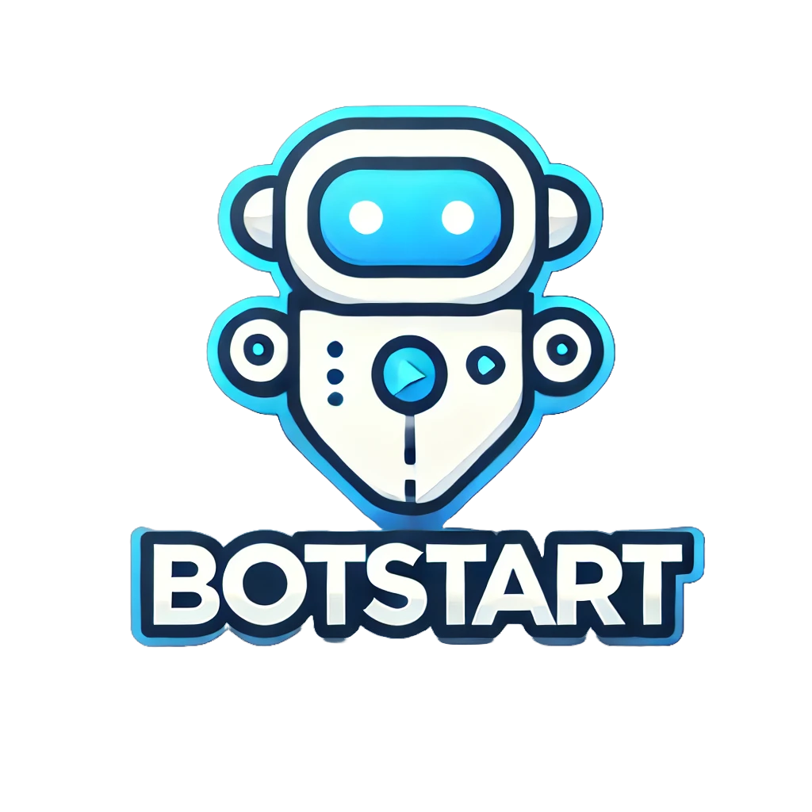

<p align="center">
  
</p>

# BotStart CLI

> No more complicated BotMan in Laravel setups.

The **BotStart CLI** helps you set up **BotMan** projects in Laravel. It provides a single command that automates the installation of BotMan dependencies, creates necessary BotMan files and configurations, and sets up a fresh Laravel project (of your choice or the latest one) if one is not already installed.


## Installation

To install the BotStart CLI, you need to use Composer. Run the following command to download the BotStart CLI globally:

```sh
composer global require prevailexcel/botstart
```


## Configuration

After installing, ensure that the `$HOME/.composer/vendor/bin` directory (or the equivalent directory for your operating system) is included in your `$PATH`. This allows your system to locate the `botstart` executable.

## Creating a New Laravel and BotMan Project

Once the installer is set up, you can create a new Laravel and BotMan project using the `botstart new {project-name} {laravel-version}` command. Replace `your_project_name` with the desired name for your project:

```sh
botstart new your_project_name 10
```

For example, to create a project with Laravel 11 named `weatherbot`, you would run:

```sh
botstart new weatherbot 11
```

This command will create a directory named `weatherbot` containing a fresh Laravel 11 Project with everything you need to get started, including a Tinker.

> If you already have a Laravel project started at that directory, it will go ahead to setupp botman for you there without any extra command. 

To use the tinker, simply run

```sh
php artisan botman:tinker
```
> BotStart installs a modified botman/tinker package which you can get here [https://github.com/prevailexcel/botman-tinker](https://github.com/prevailexcel/botman-tinker).

## Web Widget
This installer also gives you the webwidget to test your bot immediately. Simply run your project and go to the welcome or base url.

```sh
php artisan serve
```
> Then go to http://127.0.0.1:8000 or whereever your project is served.

## What exactly does it do?
- Installs BotMan dependencies:
  - `botman/botman`
  - `botman/driver-web`
  - `botman/driver-telegram`
  - `prevailexcel/botman-tinker`: A modified version of `botman/tinker`, available here: [prevailexcel/botman-tinker](https://github.com/prevailexcel/botman-tinker).
- Creates necessary configuration files, including:
  - Routes
  - Controllers
  - Environment variables
- Sets up BotMan's default route and includes a simple `hello` command.
- Configures CSRF exceptions for BotMan in Laravel.

## Documentation

You can find the BotMan and BotMan Studio documentation at [http://botman.io](http://botman.io).

## If you want to thank me?

Why not star the github repo? I'd love the attention! Why not share the link for this repository on Twitter or HackerNews? Spread the word! Big Thanks to Marcel Pociot for creating the BotMan project. I simply want to make it a lot easier for more developers.

Thanks!
[Chimeremeze Prevail Ejimadu](https://x.com/EjimaduPrevail)

## License

The MIT License (MIT). Please see [License File](LICENSE.md) for more information.